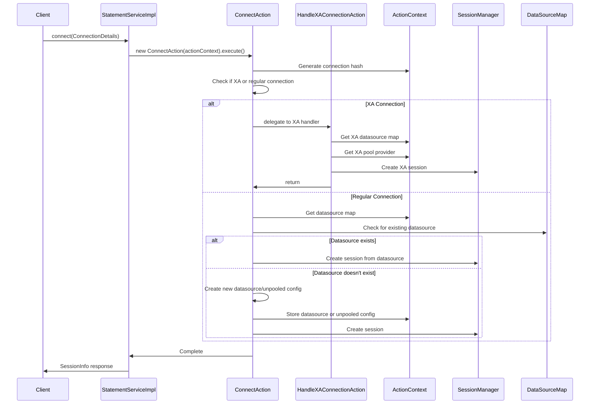

# StatementServiceImpl Action Pattern Refactoring - Migration Guide

## Executive Summary

This document describes the Action pattern refactoring strategy for `StatementServiceImpl`, a 2,528-line God class that violates the Single Responsibility Principle. The refactoring extracts each public method into dedicated Action classes, improving testability, maintainability, and code organization.

**Status**: `connect()` method implemented as reference implementation (PR #XXX)

## Problem Statement

### Current State
- **2,528 lines** in a single class
- **21 public gRPC endpoints** handling diverse responsibilities
- **9 shared state maps** with concurrent access patterns
- **14+ private helper methods** tightly coupled to the service
- Difficult to test, navigate, and maintain
- Violates Single Responsibility Principle

### Target State
- **~400 lines** in StatementServiceImpl (thin orchestrator)
- **35+ focused Action classes** (~75 lines average)
- **Centralized ActionContext** for shared state
- **4 Action interfaces** supporting all method signatures
- Each action independently testable
- Clear separation of concerns

## Architecture Overview

### Class Diagram

```mermaid
classDiagram
    class StatementServiceImpl {
        -ActionContext actionContext
        +connect(ConnectionDetails, StreamObserver)
        +executeUpdate(StatementRequest, StreamObserver)
        +executeQuery(StatementRequest, StreamObserver)
        +startTransaction(SessionInfo, StreamObserver)
        +commitTransaction(SessionInfo, StreamObserver)
        +rollbackTransaction(SessionInfo, StreamObserver)
        +xaStart(XaStartRequest, StreamObserver)
        +createLob(StreamObserver) StreamObserver
        ...20+ more methods
    }

    class ActionContext {
        -Map~String,DataSource~ datasourceMap
        -Map~String,XADataSource~ xaDataSourceMap
        -Map~String,XATransactionRegistry~ xaRegistries
        -Map~String,UnpooledConnectionDetails~ unpooledConnectionDetailsMap
        -Map~String,DbName~ dbNameMap
        -Map~String,SlowQuerySegregationManager~ slowQuerySegregationManagers
        -XAConnectionPoolProvider xaPoolProvider
        -MultinodeXaCoordinator xaCoordinator
        -ClusterHealthTracker clusterHealthTracker
        -SessionManager sessionManager
        -CircuitBreaker circuitBreaker
        -ServerConfiguration serverConfiguration
        +getDatasourceMap() Map
        +getXaDataSourceMap() Map
        +getSessionManager() SessionManager
        ...getters for all fields
    }

    class Action~TRequest,TResponse~ {
        <<interface>>
        +execute(TRequest, StreamObserver~TResponse~) void
    }

    class StreamingAction~TRequest,TResponse~ {
        <<interface>>
        +execute(StreamObserver~TResponse~) StreamObserver~TRequest~
    }

    class InitAction {
        <<interface>>
        +execute() void
    }

    class ValueAction~TRequest,TResult~ {
        <<interface>>
        +execute(TRequest) TResult
    }

    class ConnectAction {
        -ActionContext context
        +execute(ConnectionDetails, StreamObserver~SessionInfo~) void
        -handleXAConnection()
        -handleRegularConnection()
    }

    class ExecuteUpdateAction {
        -ActionContext context
        +execute(StatementRequest, StreamObserver~OpResult~) void
    }

    class ExecuteQueryAction {
        -ActionContext context
        +execute(StatementRequest, StreamObserver~OpResult~) void
    }

    class StartTransactionAction {
        -ActionContext context
        +execute(SessionInfo, StreamObserver~SessionInfo~) void
    }

    class CreateLobAction {
        -ActionContext context
        +execute(StreamObserver~LobReference~) StreamObserver~LobDataBlock~
    }

    class HandleXAConnectionWithPoolingAction {
        -ActionContext context
        +execute(ConnectionDetails, StreamObserver~SessionInfo~) void
    }

    StatementServiceImpl --> ActionContext : uses
    StatementServiceImpl ..> ConnectAction : delegates
    StatementServiceImpl ..> ExecuteUpdateAction : delegates
    StatementServiceImpl ..> ExecuteQueryAction : delegates
    StatementServiceImpl ..> StartTransactionAction : delegates
    StatementServiceImpl ..> CreateLobAction : delegates
    
    ConnectAction ..|> Action : implements
    ExecuteUpdateAction ..|> Action : implements
    ExecuteQueryAction ..|> Action : implements
    StartTransactionAction ..|> Action : implements
    CreateLobAction ..|> StreamingAction : implements
    HandleXAConnectionWithPoolingAction ..|> Action : implements
    
    ConnectAction --> ActionContext : uses
    ExecuteUpdateAction --> ActionContext : uses
    ExecuteQueryAction --> ActionContext : uses
    StartTransactionAction --> ActionContext : uses
    CreateLobAction --> ActionContext : uses
    HandleXAConnectionWithPoolingAction --> ActionContext : uses
    
    ConnectAction --> HandleXAConnectionWithPoolingAction : uses
```



### Connect Method Sequence Diagram (Reference Implementation)



## Action Interfaces

### 1. Action<TRequest, TResponse>
Standard unary/server-streaming RPC methods (covers 20 of 21 methods).

```java
public interface Action<TRequest, TResponse> {
    void execute(TRequest request, StreamObserver<TResponse> responseObserver);
}
```

**Used by**:
- Connection: `connect`
- Statement Execution: `executeUpdate`, `executeQuery`, `fetchNextRows`
- Transaction: `startTransaction`, `commitTransaction`, `rollbackTransaction`
- Session: `terminateSession`
- Resource: `callResource`
- LOB: `readLob`
- XA Operations: `xaStart`, `xaEnd`, `xaPrepare`, `xaCommit`, `xaRollback`, `xaRecover`, `xaForget`, `xaSetTransactionTimeout`, `xaGetTransactionTimeout`, `xaIsSameRM`

### 2. StreamingAction<TRequest, TResponse>
Bidirectional streaming operations (1 method).

```java
public interface StreamingAction<TRequest, TResponse> {
    StreamObserver<TRequest> execute(StreamObserver<TResponse> responseObserver);
}
```

**Used by**:
- LOB: `createLob`

### 3. InitAction
Initialization operations without parameters.

```java
public interface InitAction {
    void execute();
}
```

**Used by**:
- Initialization helpers (e.g., `initializeXAPoolProvider`)

### 4. ValueAction<TRequest, TResult>
Internal helper actions that return values directly.

```java
public interface ValueAction<TRequest, TResult> {
    TResult execute(TRequest request) throws Exception;
}
```

**Used by**:
- Internal action composition (e.g., `executeUpdateInternal`, `findLobContext`)

## ActionContext Design

### Purpose
Centralized holder for all shared state and dependencies used by Action classes. Thread-safe with ConcurrentHashMap for all maps.

### Fields

| Category | Field | Type | Description |
|----------|-------|------|-------------|
| **Datasources** | datasourceMap | Map<String, DataSource> | Regular JDBC datasources |
| | xaDataSourceMap | Map<String, XADataSource> | XA-capable datasources |
| | xaRegistries | Map<String, XATransactionRegistry> | XA transaction registries |
| | unpooledConnectionDetailsMap | Map<String, UnpooledConnectionDetails> | Unpooled connection configs |
| **Configuration** | dbNameMap | Map<String, DbName> | Database type per connection |
| | slowQuerySegregationManagers | Map<String, SlowQuerySegregationManager> | Query segregation managers |
| **XA Support** | xaPoolProvider | XAConnectionPoolProvider | XA pool SPI provider |
| | xaCoordinator | MultinodeXaCoordinator | Multinode XA coordinator |
| **Monitoring** | clusterHealthTracker | ClusterHealthTracker | Health monitoring |
| **Services** | sessionManager | SessionManager | Session/connection manager |
| | circuitBreaker | CircuitBreaker | Failure protection |
| | serverConfiguration | ServerConfiguration | Server-wide config |

## Implementation Pattern

### Before (God Class Pattern)
```java
public class StatementServiceImpl extends StatementServiceGrpc.StatementServiceImplBase {
    // 144 lines of connection logic inline
    public void connect(ConnectionDetails details, StreamObserver<SessionInfo> observer) {
        // Health checks
        // Connection hash generation
        // XA vs regular branching
        // Multinode coordination
        // Pool creation
        // Session management
        // ... 144 lines total
    }
}
```

### After (Action Pattern)
```java
public class StatementServiceImpl extends StatementServiceGrpc.StatementServiceImplBase {
    private final ActionContext actionContext;
    
    // 3 lines - thin delegator
    public void connect(ConnectionDetails details, StreamObserver<SessionInfo> observer) {
        new ConnectAction(actionContext).execute(details, observer);
    }
}
```

### Action Implementation
```java
@Slf4j
public class ConnectAction implements Action<ConnectionDetails, SessionInfo> {
    private final ActionContext context;
    
    public ConnectAction(ActionContext context) {
        this.context = context;
    }
    
    @Override
    public void execute(ConnectionDetails request, StreamObserver<SessionInfo> responseObserver) {
        // Focused logic for connection handling
        // Access shared state via context
        // Delegate to helper actions as needed
    }
}
```

## Migration Plan

### Phase 1: Infrastructure (Week 1) ✅ COMPLETED
- [x] Create Action interface hierarchy (4 interfaces)
- [x] Create ActionContext class
- [x] Initialize ActionContext in StatementServiceImpl constructor
- [x] Extract UnpooledConnectionDetails to separate class

### Phase 2: Reference Implementation (Week 2) ✅ COMPLETED
- [x] Implement ConnectAction (main orchestrator)
- [x] Implement HandleXAConnectionWithPoolingAction
- [x] Implement HandleUnpooledXAConnectionAction
- [x] Implement CreateSlowQuerySegregationManagerAction
- [x] Implement ProcessClusterHealthAction
- [x] Update StatementServiceImpl.connect() to delegate
- [x] Verify compilation and tests

### Phase 3: Simple Actions (Weeks 3-4) ⏳ NEXT
Implement actions for stateless or simple operations:

| Method | Action Class | Complexity | Estimated LOC |
|--------|--------------|------------|---------------|
| startTransaction | StartTransactionAction | Simple | 40-50 |
| commitTransaction | CommitTransactionAction | Simple | 40-50 |
| rollbackTransaction | RollbackTransactionAction | Simple | 40-50 |
| terminateSession | TerminateSessionAction | Simple | 50-60 |
| callResource | CallResourceAction | Medium | 80-100 |

### Phase 4: Statement Execution (Weeks 5-6) ⏳ PENDING
Implement core statement execution actions:

| Method | Action Class | Complexity | Estimated LOC |
|--------|--------------|------------|---------------|
| executeUpdate | ExecuteUpdateAction | Medium | 100-120 |
| executeQuery | ExecuteQueryAction | Medium | 100-120 |
| fetchNextRows | FetchNextRowsAction | Medium | 80-100 |

Helper actions:
- ExecuteUpdateInternalAction
- ExecuteQueryInternalAction
- ProcessResultSetAction

### Phase 5: XA Operations (Weeks 7-8) ⏳ PENDING
Implement XA transaction actions:

| Method | Action Class | Complexity | Estimated LOC |
|--------|--------------|------------|---------------|
| xaStart | XaStartAction | Medium | 90-110 |
| xaEnd | XaEndAction | Simple | 40-50 |
| xaPrepare | XaPrepareAction | Medium | 50-60 |
| xaCommit | XaCommitAction | Medium | 50-60 |
| xaRollback | XaRollbackAction | Medium | 50-60 |
| xaRecover | XaRecoverAction | Medium | 30-40 |
| xaForget | XaForgetAction | Simple | 30-40 |
| xaSetTransactionTimeout | XaSetTransactionTimeoutAction | Simple | 30-40 |
| xaGetTransactionTimeout | XaGetTransactionTimeoutAction | Simple | 30-40 |
| xaIsSameRM | XaIsSameRMAction | Simple | 30-40 |

### Phase 6: LOB Operations (Week 9) ⏳ PENDING
Implement streaming LOB actions:

| Method | Action Class | Complexity | Estimated LOC |
|--------|--------------|------------|---------------|
| createLob | CreateLobAction | Complex | 150-180 |
| readLob | ReadLobAction | Complex | 150-180 |

Helper actions:
- ProcessLobDataBlockAction
- FindLobContextAction

### Phase 7: Cleanup & Testing (Week 10) ⏳ PENDING
- Remove all extracted code from StatementServiceImpl
- Final integration testing
- Performance benchmarking
- Update documentation
- Code review

## Package Structure

```
org.openjproxy.grpc.server
├── StatementServiceImpl.java (~400 lines - orchestrator)
├── ActionContext.java
├── UnpooledConnectionDetails.java
└── action/
    ├── Action.java
    ├── StreamingAction.java
    ├── InitAction.java
    ├── ValueAction.java
    ├── connection/
    │   ├── ConnectAction.java ✅
    │   ├── HandleXAConnectionWithPoolingAction.java ✅
    │   ├── HandleUnpooledXAConnectionAction.java ✅
    │   ├── CreateSlowQuerySegregationManagerAction.java ✅
    ├── transaction/
    │   ├── StartTransactionAction.java ⏳
    │   ├── CommitTransactionAction.java ⏳
    │   └── RollbackTransactionAction.java ⏳
    ├── statement/
    │   ├── ExecuteUpdateAction.java ⏳
    │   ├── ExecuteQueryAction.java ⏳
    │   ├── FetchNextRowsAction.java ⏳
    │   ├── ExecuteUpdateInternalAction.java ⏳
    │   └── ExecuteQueryInternalAction.java ⏳
    ├── xa/
    │   ├── XaStartAction.java ⏳
    │   ├── XaEndAction.java ⏳
    │   ├── XaPrepareAction.java ⏳
    │   ├── XaCommitAction.java ⏳
    │   ├── XaRollbackAction.java ⏳
    │   ├── XaRecoverAction.java ⏳
    │   ├── XaForgetAction.java ⏳
    │   ├── XaSetTransactionTimeoutAction.java ⏳
    │   ├── XaGetTransactionTimeoutAction.java ⏳
    │   └── XaIsSameRMAction.java ⏳
    ├── lob/
    │   ├── CreateLobAction.java ⏳
    │   ├── ReadLobAction.java ⏳
    │   ├── ProcessLobDataBlockAction.java ⏳
    │   └── FindLobContextAction.java ⏳
    ├── session/
    │   └── TerminateSessionAction.java ⏳
    ├── resource/
    │   └── CallResourceAction.java ⏳
    └── util/
        ├── ProcessClusterHealthAction.java ✅
        └── ProcessResultSetAction.java ⏳
```

## Implementation Guidelines

### For Contributors

#### 1. Study the Reference Implementation
- Review PR #XXX (connect method refactoring)
- Study `ConnectAction` and its helper actions
- Understand the ActionContext usage pattern

#### 2. Choose an Issue
- Start with "Simple" complexity issues if new to the codebase
- Check the issue labels: `good first issue`, `ojp-server`, `feature`
- Comment on the issue to claim it

#### 3. Implementation Steps
1. **Create the Action class** in the appropriate package
2. **Implement the interface** (Action, StreamingAction, InitAction, or ValueAction)
3. **Extract logic** from StatementServiceImpl method (copy-paste, then refactor)
4. **Update references** to use `context.getXxx()` for shared state
5. **Update StatementServiceImpl** to delegate to the new action
6. **Compile and test** - ensure no regressions
7. **Create PR** referencing the original issue

#### 4. Testing
- Ensure existing tests pass
- Add unit tests for the new action class
- Test edge cases and error handling

#### 5. Code Review Checklist
- [ ] Action class is focused on single responsibility
- [ ] All shared state accessed through ActionContext
- [ ] Error handling preserved from original method
- [ ] Logging preserved and appropriate
- [ ] Thread safety maintained
- [ ] No functional changes (pure refactoring)
- [ ] Compilation successful
- [ ] Tests passing

### Common Patterns

#### Pattern 1: Simple Delegation
```java
// In StatementServiceImpl
public void methodName(Request request, StreamObserver<Response> observer) {
    new MethodNameAction(actionContext).execute(request, observer);
}
```

#### Pattern 2: Accessing Shared State
```java
// In Action class
DataSource ds = context.getDatasourceMap().get(connHash);
SessionManager sessionManager = context.getSessionManager();
```

#### Pattern 3: Error Handling
```java
// Preserve original error handling
try {
    // Action logic
    responseObserver.onNext(response);
    responseObserver.onCompleted();
} catch (SQLException e) {
    log.error("Error in action", e);
    sendSQLExceptionMetadata(e, responseObserver);
}
```

#### Pattern 4: Helper Action Composition
```java
// Main action delegates to helper actions
public void execute(Request request, StreamObserver<Response> observer) {
    HelperResult result = new HelperAction(context).execute(request);
    // Use result
}
```

## Expected Outcomes

### Quantitative Improvements

| Metric | Before | After | Improvement |
|--------|--------|-------|-------------|
| Main class LOC | 2,528 | ~400 | -84% |
| Number of classes | 1 | ~36 | +3,500% |
| Average class size | 2,528 | ~75 | -97% |
| Testable units | 1 | ~36 | +3,500% |
| Cyclomatic complexity | Very High | Low | Significant |
| Method length | 10-200 lines | 20-80 lines | More consistent |

### Qualitative Improvements
- ✅ **Testability**: Each action independently testable
- ✅ **Maintainability**: Focused classes easier to understand and modify
- ✅ **Navigability**: Clear package structure and naming
- ✅ **Onboarding**: New developers can understand individual actions
- ✅ **Debugging**: Easier to trace and debug specific operations
- ✅ **Code Review**: Smaller, focused PRs easier to review
- ✅ **Parallel Development**: Multiple developers can work on different actions

## Reference Implementation

See PR #XXX for the complete implementation of the `connect()` method refactoring:
- ConnectAction with full connection handling logic
- Helper actions for XA pooling and unpooled connections
- ActionContext initialization and usage
- Complete test coverage
- Compilation verification

Use this PR as a template for implementing remaining methods.

## Questions & Support

For questions or clarifications:
1. Comment on the specific GitHub issue
2. Reference this migration guide
3. Review the reference implementation (PR #XXX)
4. Ask in project discussions

## License

This refactoring maintains the same license as the parent OJP project.
